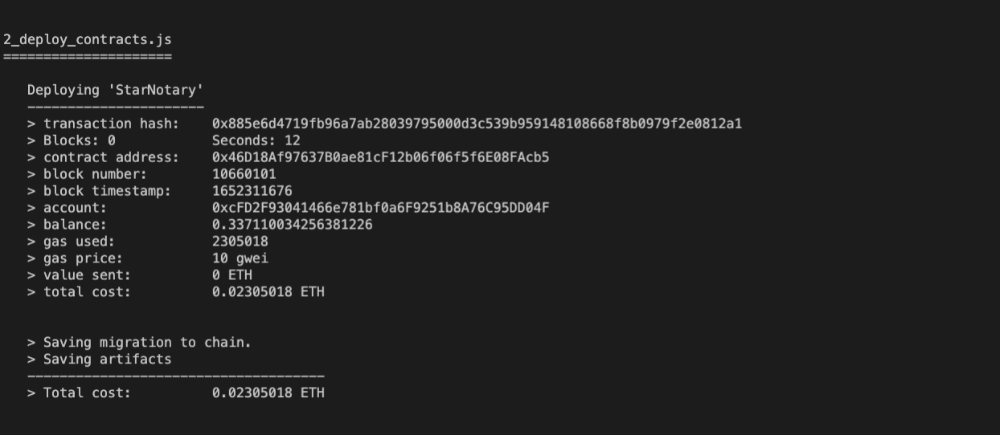

# ND1309 C2 Ethereum Smart Contracts, Tokens and Dapps 

## My Project Submission:

1. ### Specify the Truffle version and OpenZeppelin version used in the project
  Truffle v5.1.14-nodeLTS.0 (core: 5.1.13)
  Solidity v0.5.16 (solc-js)
  Node v12.22.12

2. ### ERC-721 Token Name: 
  ### StarNotary

3. ### ERC-721 Token Symbol:
   ### MDY

4. ### “Token Address” on the Rinkeby Network:
   ### "0x46D18Af97637B0ae81cF12b06f06f5f6E08FAcb5"

5. ### Create Star
 

6. ### Deploy contract to Rinkeby:
  

7. ### Etherscan
  

8. ### Importing Token
  

9. ### Look Up Star
  