# CofeeBeansSupplyChainDapp_project

## Getting Started

These instructions will get you a copy of the project up and running on your local machine for development and testing purposes. See deployment for notes on how to deploy the project on a live system.

### Prerequisites

Please make sure you've already installed ganache-cli, Truffle and enabled MetaMask extension in your browser.

```
Give examples (to be clarified)
```

### Installing

> The starter code is written for **Solidity v0.4.24**. At the time of writing, the current Truffle v5 comes with Solidity v0.5 that requires function _mutability_ and _visibility_ to be specified (please refer to Solidity [documentation](https://docs.soliditylang.org/en/v0.5.0/050-breaking-changes.html) for more details). To use this starter code, please run `npm i -g truffle@4.1.14` to install Truffle v4 with Solidity v0.4.24.

```
cd CoffeeBeansSupplyChainDapp_Project
npm install
```

### Part-1

#### UML

Activity Diagram

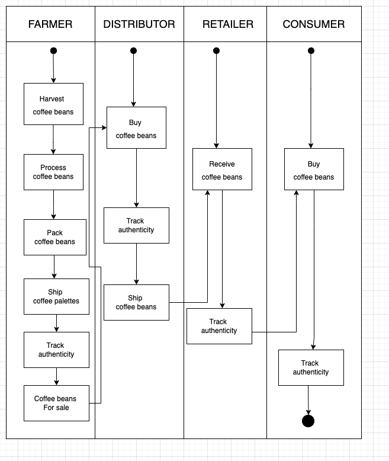

Sequence Diagram
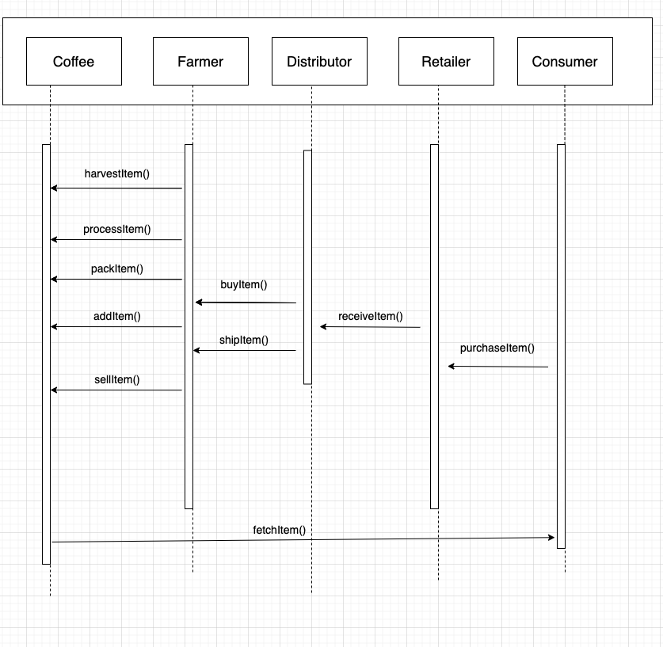

State Diagram
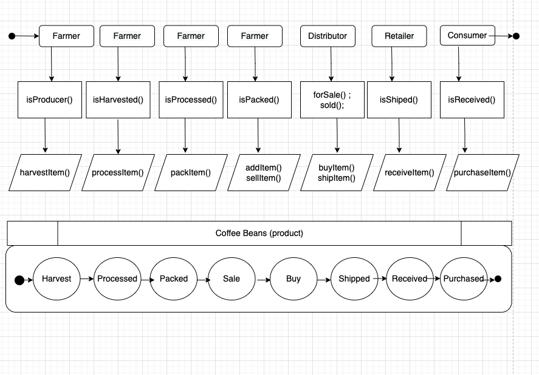

Data Modeling
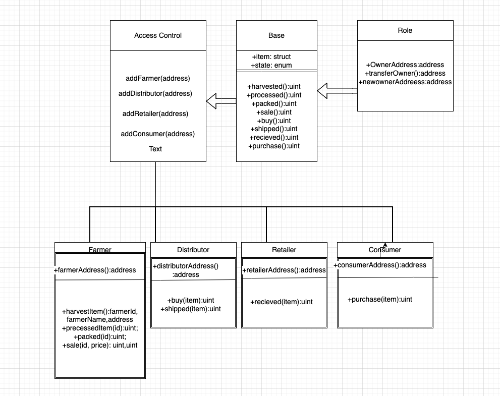

#### Library used

truffle-hdwallet-provider: For deploying in rinkeby network. used in truffle-config.js file;

### Part -2

Launch Ganache:

```
ganache-cli -m "spirit supply whale amount human item harsh scare congress discover talent hamster"
```

In a separate terminal window, Compile smart contracts:

```
truffle compile
```

This will create the smart contract artifacts in folder `build\contracts`.

Migrate smart contracts to the locally running blockchain, ganache-cli:

```
truffle migrate
```

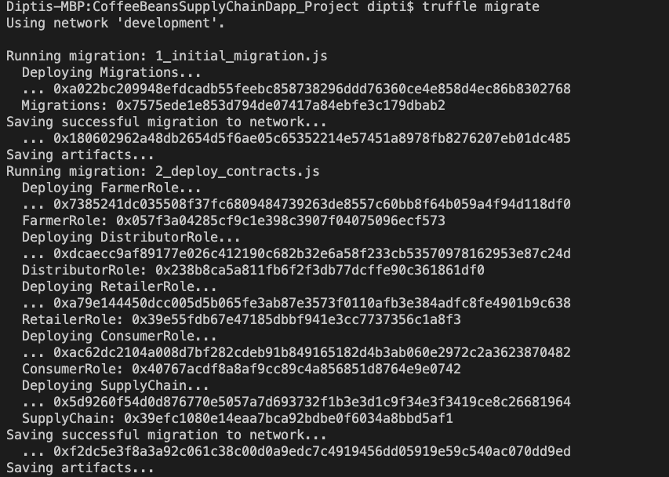

### Part-3

Test smart contracts:

```
truffle test
```

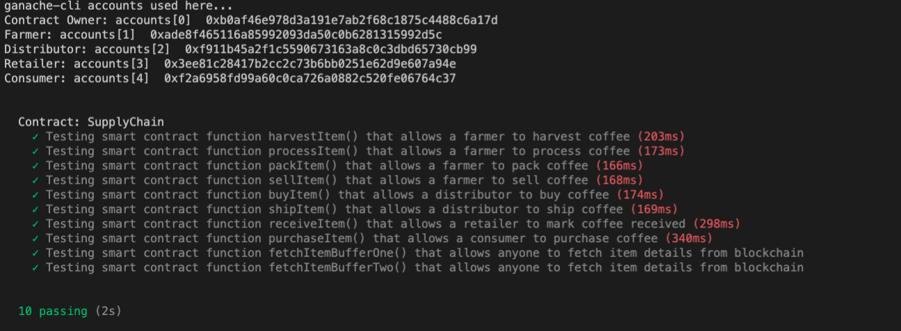

In a separate terminal window, launch the DApp:

```
npm run dev
```

### Part - 4

Deploy in public network

```
truffle migrate --network rinkeby
```

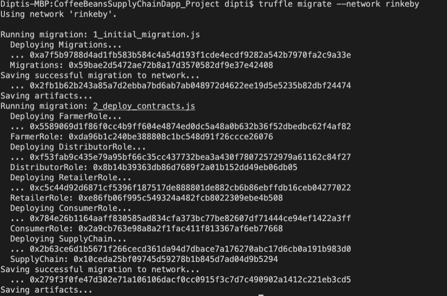

##### Trasaction hash: 0x279f3f0fe47d302e71a106106dacf0cc0915f3c7d7c490902a1412c221eb3cd5

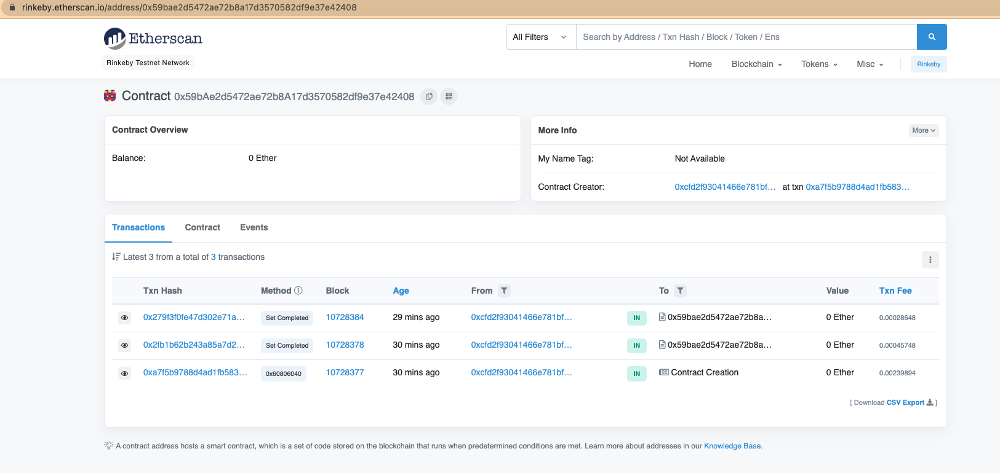

https://rinkeby.etherscan.io/tx/0x279f3f0fe47d302e71a106106dacf0cc0915f3c7d7c490902a1412c221eb3cd5

### Part-5

##### Front End

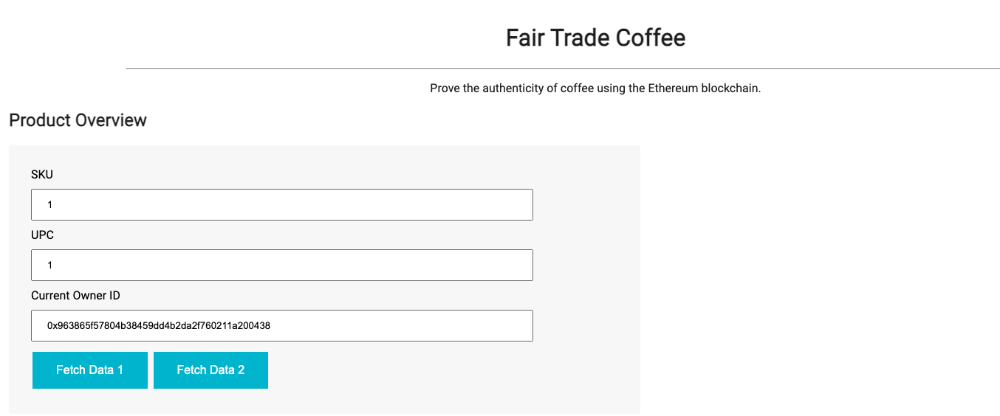
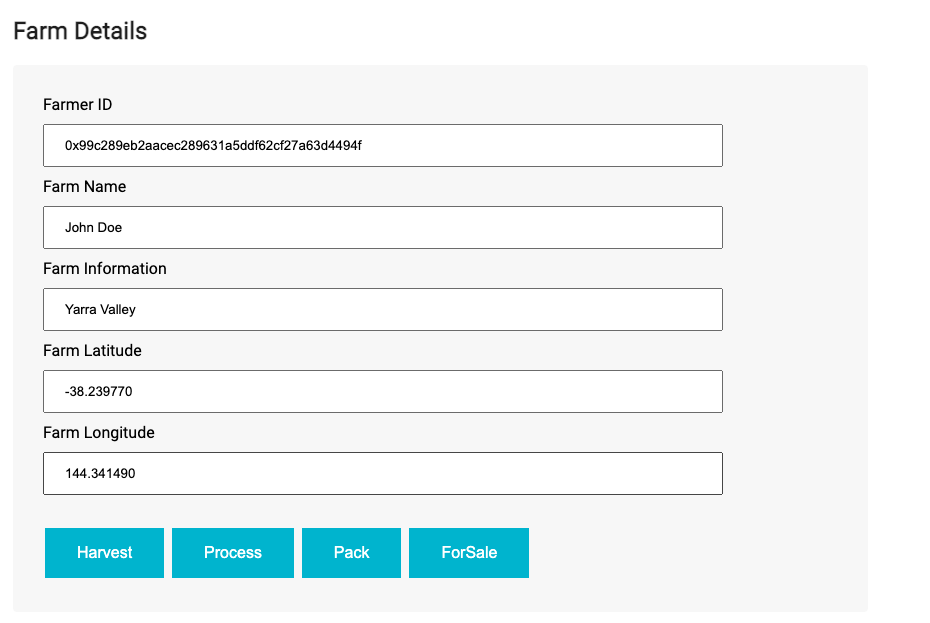
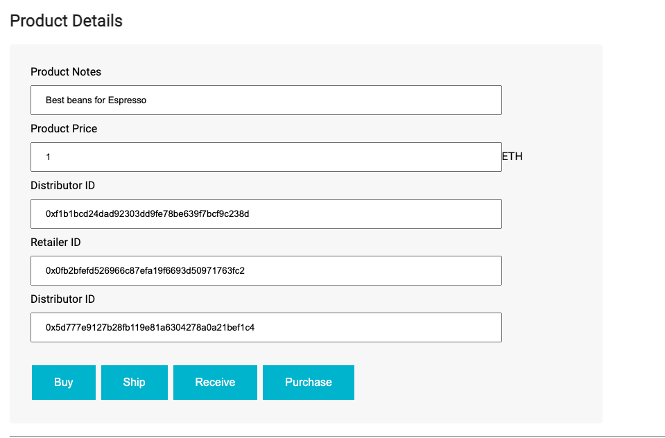
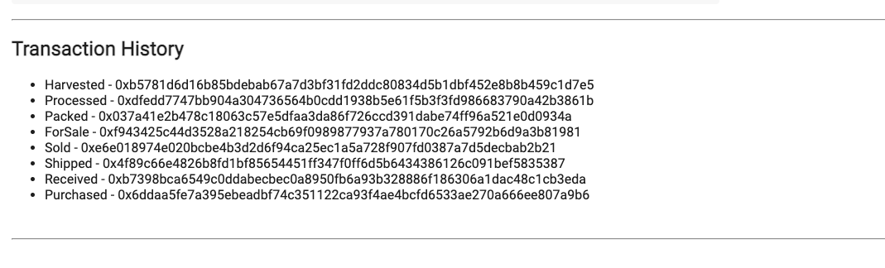
